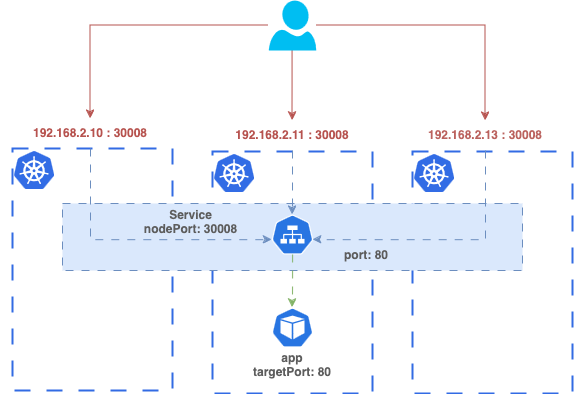

# Services

<p align="left"></p>

## Commands

### Describe

```sh
kubectl describe svc SERVICE_NAME -n NAMESPACE
```
```sh
kubectl describe svc mysql-service -n app-space | grep -i selector
```

### Expose

```sh
kubectl expose pod redis --port=6379 --name redis-service
```

## Examples

- ClusterIP:

```yaml
apiVersion: v1
kind: Service
metadata:
  name: backstage
  namespace: backstage
spec:
  selector:
    app: backstage
  ports:
    - targetPort: 80
      port: 80
```

- NodePort:

```yaml
apiVersion: v1
kind: Service
metadata:
  name: my-service-webapp
  namespace: app-space
spec:
  selector:
    app: webapp
  ports:
    - targetPort: 80
      port: 80
      nodePort: 30008
  type: NodePort
```

<p align="left"></p>

---

<p align="left"><a href="https://github.com/paulofponciano/k8s-daily-commands-and-troubleshoot"></a></p>

